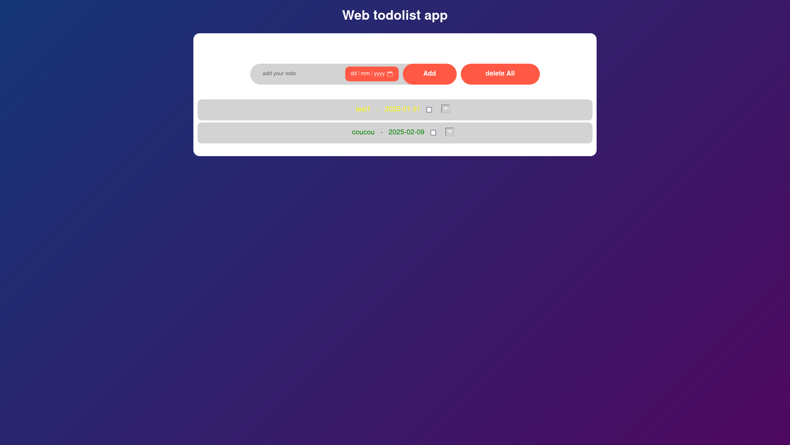

import { Badge } from '@astrojs/starlight/components';

## Rust todo list

<Badge text="Rust" variant="note" />
<Badge text="Serde" variant="caution" />
<Badge text="Clap" variant="caution" />

Pendant mon apprentissage du langage [Rust](/dossier-formation/technologies/rust), j'ai découvert l'importance du système de gestion de la mémoire grâce au concept d'ownership, qui garantit la sécurité sans garbage collector. J'ai aussi appris à utiliser les références et l'emprunt pour partager des données efficacement, tout en respectant les règles strictes de validité et de mutabilité. Enfin, les exercices Rustlings m'ont permis de mettre en pratique ces concepts, renforçant ma compréhension des slices, des structures, et des mécanismes de copie et de déplacement des valeurs.

## Technologies et concepts utilisés

- Serde : pour sérialiser et désérialiser les tâches, facilitant leur stockage et récupération en toute sécurité.
- Ownership et borrowing : pour gérer la mémoire efficacement sans garbage collector.
- Structs et slices : pour organiser les données et manipuler des sous-ensembles de manière flexible et performante.
- Rustlings : des exercices pratiques qui m'ont aidé à renforcer ma compréhension des bases du langage et à résoudre les problèmes rencontrés lors du développement.

## HTML CSS

Dans ce projet, j'ai créé un site web statique en me basant sur une maquette Figma. Le processus a consisté à transformer les éléments de design (structure, couleurs, typographie, etc.) en code HTML et CSS. J'ai veillé à respecter les spécifications de la maquette pour garantir une reproduction fidèle du design, tout en optimisant l'interface pour une navigation fluide.

## Technologies utilisées :

- HTML : pour la structure du site, en respectant les balises et les bonnes pratiques pour l'accessibilité.
- CSS : pour le style, avec une attention particulière portée à la mise en page, aux couleurs et à la typographie.
- Responsive design : pour assurer que le site soit adapté aux différents appareils (mobiles, tablettes, ordinateurs).

## Javascript

<Badge text="JavaScript" variant="note" />
<Badge text="DOM" variant="caution" />
<Badge text="Fetch" variant="caution" />

J'ai appris à manipuler le DOM en [JavaScript](/dossier-formation/technologies/javascript) pour interagir dynamiquement avec les éléments d'une page web. J'ai également maîtrisé l'utilisation de fetch pour récupérer des données depuis un site ou une autre source externe, ce qui me permet de créer des applications web interactives et réactives.

## Technologies et concepts utilisés

- DOM : Manipulation du DOM pour interagir avec les éléments d'une page web, modifier leur contenu et gérer des événements utilisateur en temps réel.
- Fetch : Utilisation de fetch pour récupérer des données depuis des API ou d'autres sources externes, permettant ainsi d'intégrer des informations dynamiques dans l'application sans recharger la page.

## TypeScript Todo list

<Badge text="TypeScript" variant="note" />

Dans le cadre de mon apprentissage de [TypeScript](/dossier-formation/technologies/javascript), j'ai développé une application de gestion de tâches (todo list) pour un site web. Ce projet m'a permis de renforcer ma maîtrise de TypeScript en manipulant le DOM, en gérant des événements utilisateurs et en utilisant des fonctionnalités avancées du langage pour créer une interface interactive et fonctionnelle.

## Technologies et concepts utilisés

- TypeScript : pour ajouter des types statiques et améliorer la sécurité et la lisibilité du code.
- DOM Manipulation : pour interagir avec la page web et mettre à jour dynamiquement la liste des tâches.
- Event Handling : pour gérer les actions de l'utilisateur, comme l'ajout et la suppression de tâches.
- Local Storage : pour sauvegarder les tâches et les récupérer après un rafraîchissement de la page.

